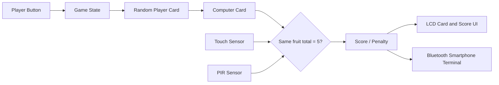

# STM32 Halli Galli Game System

> 제한된 보존 자료를 바탕으로 정리한 학부 임베디드 팀 프로젝트 사례

## 15초 요약

| 항목 | 내용 |
|---|---|
| 프로젝트 | STM32 기반 1인 대 컴퓨터 할리갈리 |
| 형태 | 4인 학부 팀 프로젝트 |
| 당시 결과 | 최종 하드웨어 시연 및 과제 통과 |
| 확인된 기술 | C, STM32F10x, GPIO, Timer, 센서 입력, LCD, Bluetooth |
| 현재 자료 | 최종 보고서 기반 구성·역할 기록과 대표 센서 코드 2개 |
| 개인 기여 | 코드 최적화, 인터페이스 설계, 디버깅, 테스트, 하드웨어 설계 |

이 프로젝트는 팀이 실제 하드웨어를 끝까지 통합해 최종 과제를 통과한 경험입니다.
이 저장소는 최종 보고서와 보존 코드를 대조해 확인한 개인 기여를 중심으로 정리하며,
팀 전체 구현과 대표 부분 코드의 범위를 구분합니다.

## 프로젝트에서 보여줄 역량

- 포트 수와 안정성 제약에 맞춰 4인 구상을 1인 대 컴퓨터 구조로 조정한 경험
- 버튼·터치·PIR 입력과 게임 상태, LCD·Bluetooth 출력을 통합한 경험
- 마감 직전 장시간 통합·디버깅에 참여한 협업 경험
- 점수·입력·진행 오류를 전체 사용자 흐름에서 반복 검증한 경험
- 불완전하게 보존된 산출물을 근거 중심으로 재검토하는 태도

## 시스템 구성

보고서에서 확인되는 전체 구성과 현재 보존된 코드의 범위는 서로 다릅니다.

최종 보고서에서는 버튼으로 카드를 진행하고, 동일 과일 합계가 5일 때 터치 입력을
판정하며, 잘못된 접근은 PIR 센서로 감지해 감점합니다. 점수와 결과는 LCD와 스마트폰
터미널에 출력합니다.

세부 구조는 [`docs/ARCHITECTURE.md`](docs/ARCHITECTURE.md)에 정리합니다.

## 현재 확인된 자료

| 자료 | 확인 결과 | 공개 여부 |
|---|---|---|
| 결과·설계 문서 | 시스템 목표, 최종 동작과 개인 역할 확인 | 사실 확인에만 사용 |
| 터치 센서 코드 | 대표 부분 코드로 포함, 독립 동작 실험 형태 | 공개 포함 |
| 초음파 센서 코드 | 대표 부분 코드로 포함, 독립 측정 실험 형태 | 공개 포함 |

보존 자료의 기술 판정은 [`docs/ORIGINAL_REVIEW.md`](docs/ORIGINAL_REVIEW.md)를 참조합니다.

대표 부분 코드는 [`src/preserved-modules/`](src/preserved-modules/)에서 확인할 수 있습니다.
두 파일의 원본 제어 흐름은 보존했으며, 수정·보완 코드는 향후
[`src/reconstruction-2026/`](src/reconstruction-2026/)에 분리합니다.

## 개인 기여

최종 보고서의 역할 분담과 당시 경험 회고를 대조해 다음 기여를 확인했습니다.

- LCD 카드·점수 인터페이스 설계
- 게임 결과의 스마트폰 터미널 출력 흐름 구성·점검
- 코드 최적화, 디버깅과 반복 테스트
- breadboard 부품 배치와 하드웨어 설계
- 난이도, 게임 진행과 규칙 개선

- 역할과 직접 구현: [`docs/CONTRIBUTION.md`](docs/CONTRIBUTION.md)
- 협업과 통합 과정: [`docs/COLLABORATION.md`](docs/COLLABORATION.md)
- 문제 발견·해결 과정: [`docs/PROBLEM_SOLVING.md`](docs/PROBLEM_SOLVING.md)

## 대표 문제해결

1. 포트 수와 안정성을 고려해 초기 4인 구상을 1인 대 컴퓨터 구조로 축소했습니다.
2. PIR 센서의 위치와 감지 방식을 조정해 잘못된 터치 시도를 판정하도록 개선했습니다.
3. 점수 오계산과 버튼 입력 후 진행 정지 문제를 상태 흐름 단위로 반복 재현·수정했습니다.

정확한 저수준 원인을 확인할 수 없는 항목은 추측하지 않고 관찰·조치·결과만 기록합니다.

## 결과 근거

- 당시 최종 하드웨어 시연 및 과제 통과
- 최종 보고서에서 게임 구성, 통합 동작과 개인 역할 확인
- 보존된 대표 센서 코드의 제어 흐름 정적 검토
- 당시 경험 회고와 역할 기록을 대조해 협업·문제해결 과정 구성

## 공개 범위

공개 저장소에는 직접 작성이 확인된 코드, 직접 작성한 설명, 개인정보를 제거하고 공개
권한을 확인한 이미지와 2026년 독립 검증 자료만 포함합니다. 교수 제공 문서·과제 명세,
팀원 코드, 개인정보 포함 보고서, 출처가 불명확한 LCD·터치 드라이버는 포함하지 않습니다.

- 공개 및 저작권 기준: [`docs/COPYRIGHT.md`](docs/COPYRIGHT.md)
- 심사위원용 요약: [`docs/CASE_STUDY.md`](docs/CASE_STUDY.md)

## 포트폴리오 배치

이 사례는 팀 통합, 하드웨어 완성, 제약에 따른 설계 변경과 마감 대응을 보여주는 협업
대표 사례로 배치합니다. 구현 범위는 확인된 개인 기여와 대표 부분 코드로 한정합니다.
