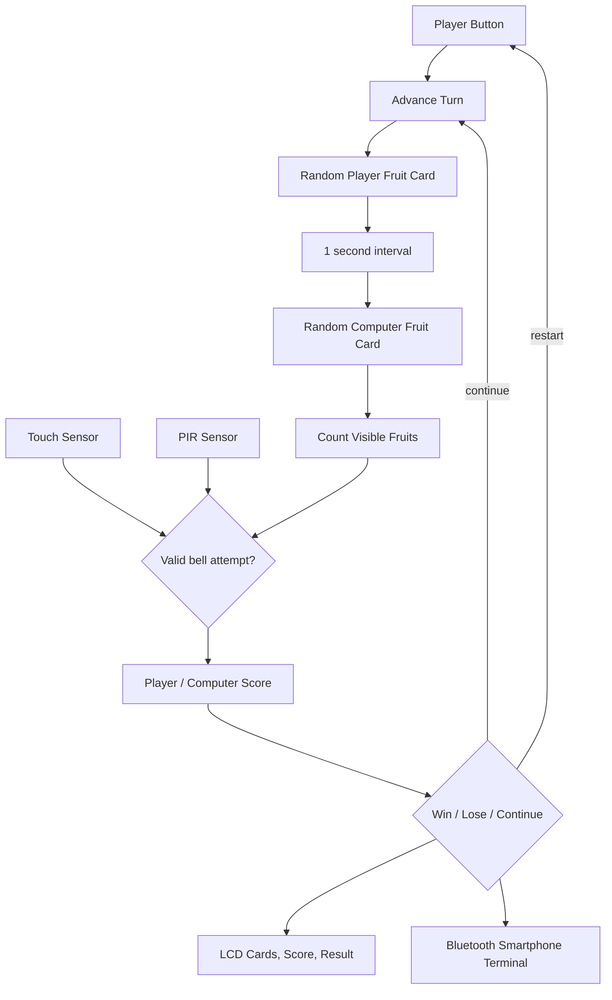
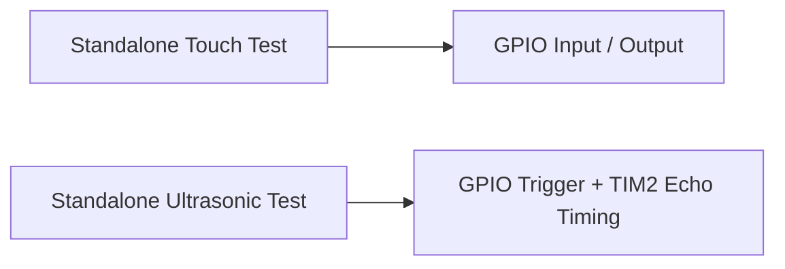

# Architecture

## 문서 기준 전체 구조

최종 보고서 기준으로 성공한 터치는 플레이어에게 점수를 주고, 조건을 만족하지 않은
접근은 PIR 센서로 감지해 감점합니다. 승패 조건을 만족하면 LCD와 스마트폰 터미널에
결과를 출력하며 버튼으로 게임을 다시 시작합니다.

초기 4인 플레이 구상은 포트 수와 안정성 제약 때문에 1인 대 컴퓨터 구조로 변경됐습니다.
이는 단순 기능 삭제가 아니라 핵심 게임 흐름을 유지하면서 시연 안정성을 높인 범위
조정으로 정리합니다.

## 현재 보존 코드

두 코드는 각각 독립 `main()`을 포함하고 있어 하나의 통합 프로젝트가 아닙니다.

## 개인 기여가 연결된 지점

- 게임 상태 → LCD 카드·점수 인터페이스
- 게임 상태·승패 결과 → Bluetooth 스마트폰 터미널
- 버튼·점수·진행 상태 → 통합 디버깅과 반복 테스트
- 센서·버튼·LCD·Bluetooth 부품 → breadboard 배치와 하드웨어 설계

전체 통합 소스가 없어 당시 함수·전역 변수·핀 번호 단위의 연결은 확정하지 않습니다.

## 면접용 데이터 흐름

> 버튼과 센서 입력을 게임 상태와 점수 판정으로 연결하고, 그 결과를 LCD 카드·점수
> 인터페이스와 Bluetooth 스마트폰 터미널에 일관되게 출력했습니다. 통합 단계에서는
> 입력부터 화면 갱신까지의 흐름을 반복 실행해 진행 정지와 점수 오류를 확인했습니다.
